# REPORT
## Steps required

The objective is to show that the following activities have been accomplished:

- The two services `accounts (2222)` and `web` are running and registered (two terminals, logs screenshots).
- The service registration service has these two services registered (a third terminal, dashboard screenshots)
- A second `accounts` service instance is started and will use the port 4444. This second `accounts (4444)` is also
  registered (a fourth terminal, log screenshots).
- What happens when you kill the service `accounts (2222)` and do requests to `web`?  
  Can the web service provide information about the accounts again? Why?
 

  The above must be documented in a brief report (`REPORT.md`) with screenshots describing what happens.

### First Step

First, we launch the registration server.
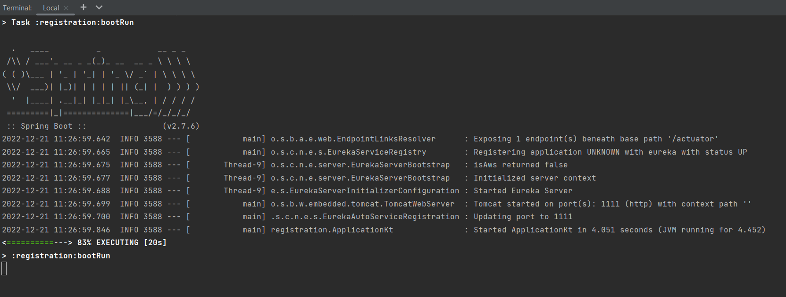

The application is running correctly
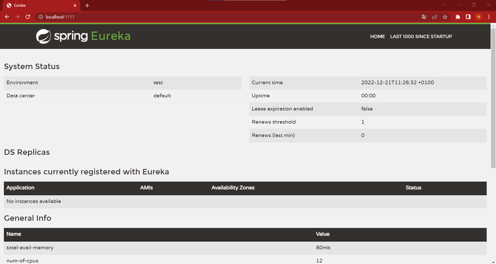

Now, we launch the Account Service, after launching this service we can see in the dashboard of Eureka the ACCOUNTS-SERVICE.
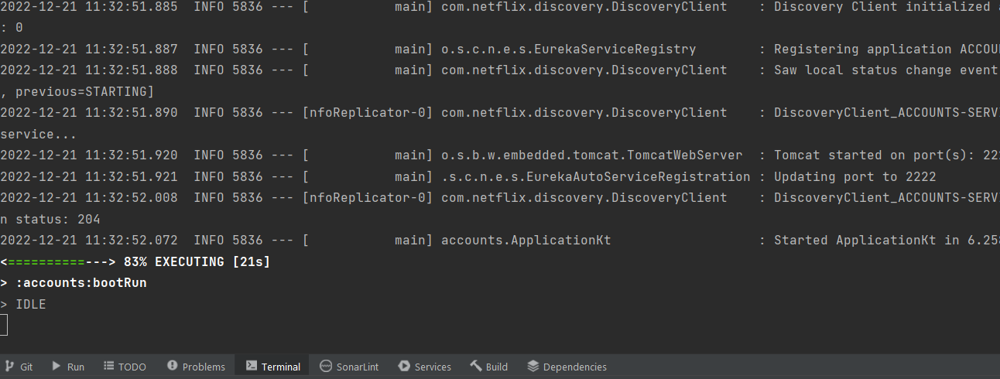

The application is running correctly
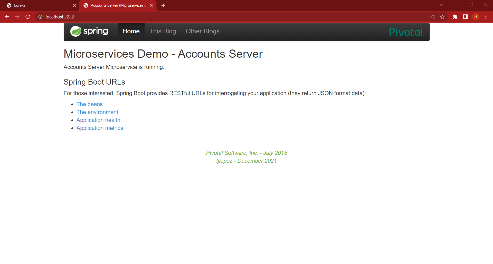

We can see the dashboard of Eureka.
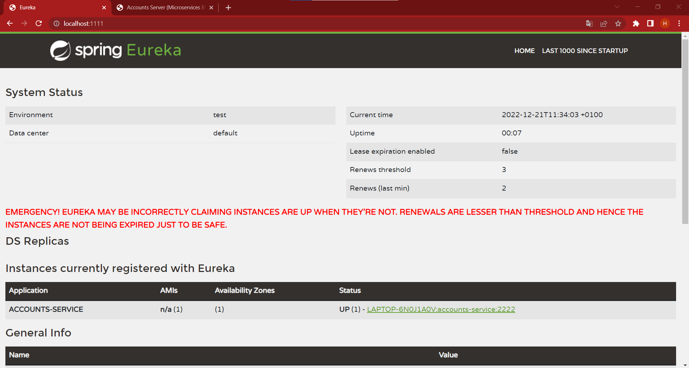

Last, we launch Web Service to provide an MVC front-end to the application of accounts
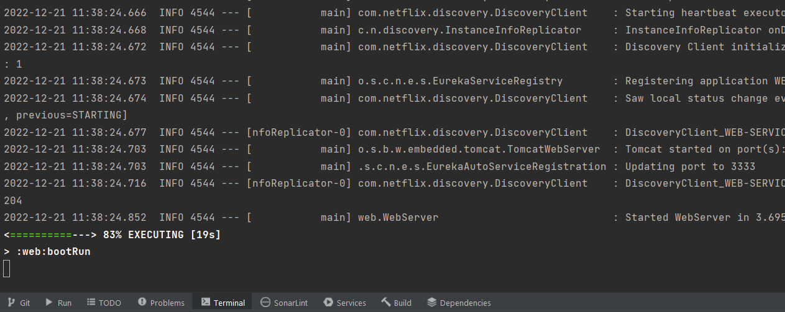

At port 3333 we can see the web application
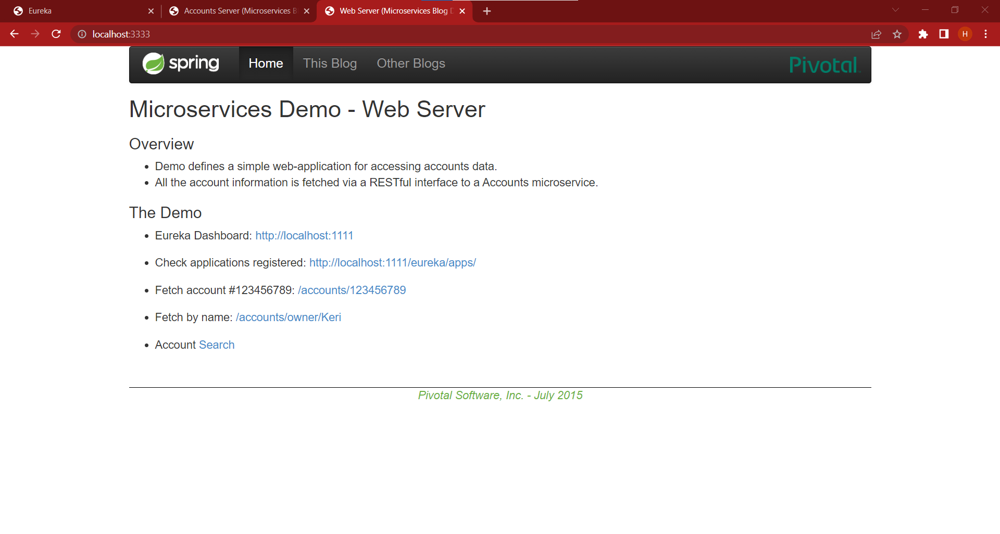

### Second Step
After launching the three application we can see on the registration server that the other two services we launched are registered in Eureka
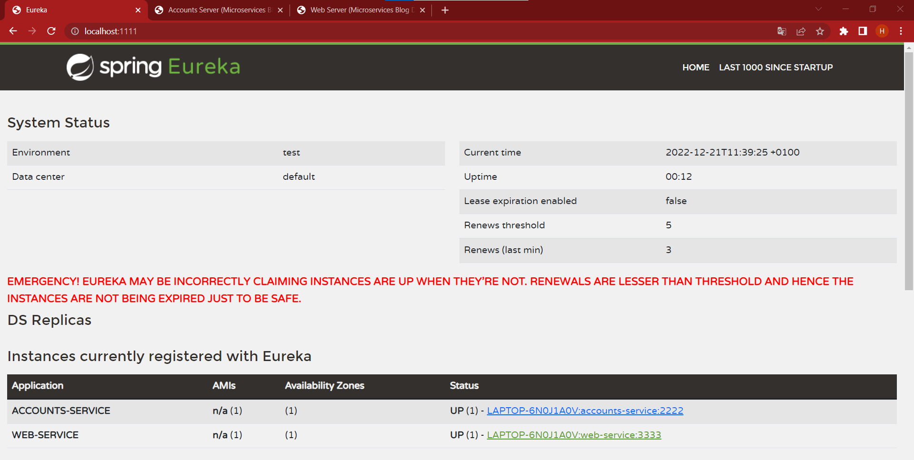

### Third Step 
For this step we change the port for the account application to the 4444
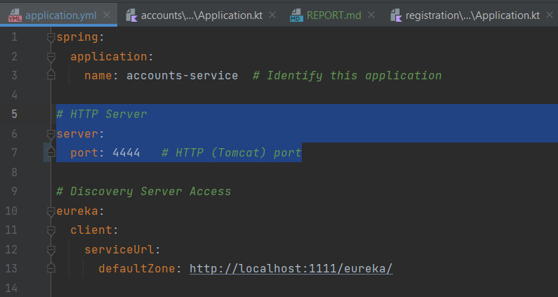

Now, we launch another account service and check the Eureka dashboard
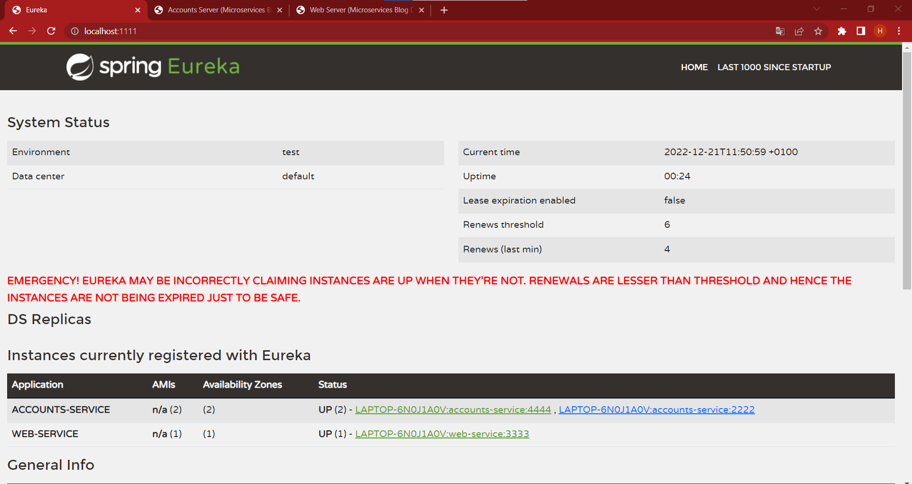

### Fourth Step
For this last step we will kill Account service at 2222 and check if web service stills providing information about the account

Kill the account 2222
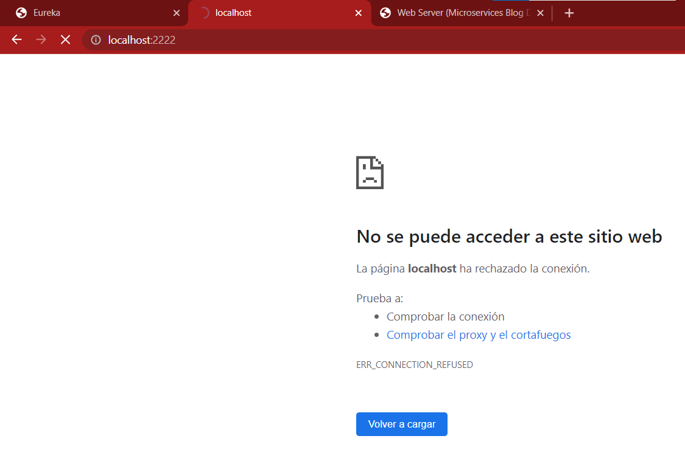

And check the web service

When we try to connect with account at 2222 it fails, cause this service is not running anymore 
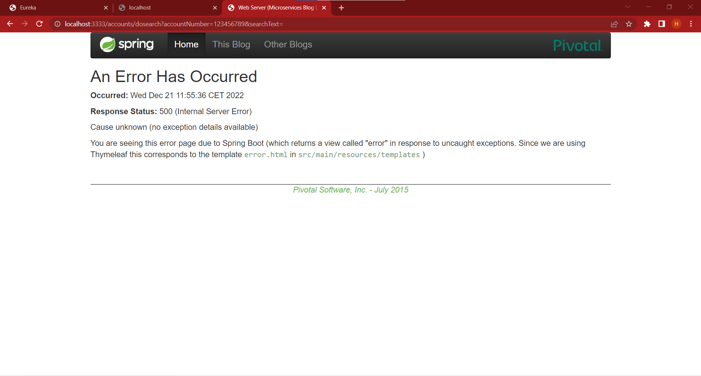

But, if we recharge the page, after fail the connection we connect to 4444, which is running
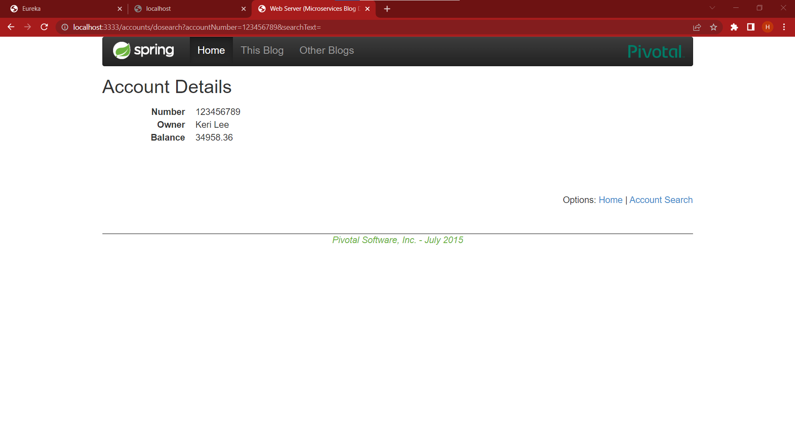